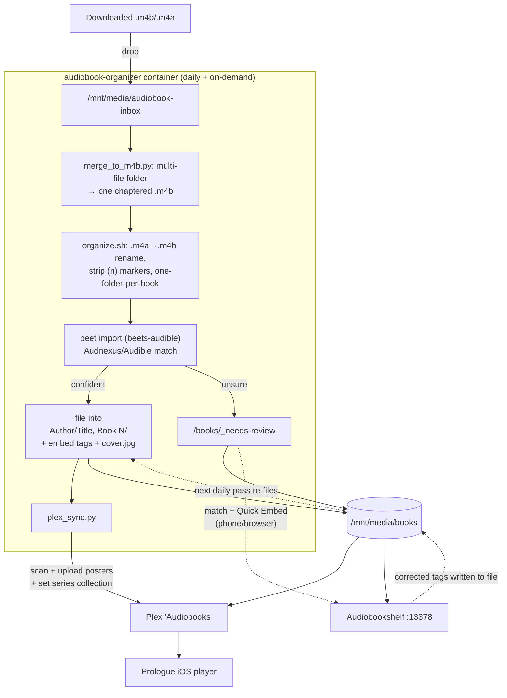

# audiobook-organizer

Automated audiobook pipeline for the `media` stack: drop a file, get it tagged
with Audible metadata, filed into the library convention, given a Plex cover and
a series collection, and made reviewable from a phone — with **Plex + Prologue**
as the player.

## Parts

| Part | What it is | Where |
|---|---|---|
| **Drop folder** | Where you put new `.m4b`/`.m4a` files | `/mnt/media/audiobook-inbox` |
| **`audiobook-organizer`** | Container: `beets` + `beets-audible` + `ffmpeg` + this glue | `media/docker-compose.yml` |
| ├ `entrypoint.sh` | Runs one organize pass at start, then every 24h | baked into image |
| ├ `organize.sh` | Preprocess inbox → beets import → park unsure → Plex sync | baked into image |
| ├ `config.yaml` | beets config (paths, match threshold, plugins) | mounted `:ro` from repo |
| └ `plex_sync.py` | Push covers + build series collections in Plex | baked into image |
| **Library** | Organized output, read by Plex + ABS | `/mnt/media/books/<Author>/<Title, Book N>/` |
| **`_needs-review`** | Unsure matches park here (Plex-ignored via `.plexignore`) | `/mnt/media/books/_needs-review` |
| **Audiobookshelf** | Mobile match/embed UI for fixing unsure books | container, `:13378` |
| **Plex** | Library (`Audiobooks`, new Music agent) | container, host-net `:32400` |
| **Prologue** | iOS player (offline), reads from Plex + its collections | your phone |

## How it flows



Text version of the flow:

```
drop file → /audiobook-inbox
     │
     ▼  organize.sh (daily @ container-start +24h, or `organize --interactive`)
  rename .m4a→.m4b · strip "(n)" · one-folder-per-book
     │
     ▼  beets + beets-audible  ── Audible/Audnexus match
     ├─ confident ─▶ /books/<Author>/<Title, Book N>/  (embedded tags + cover.jpg)
     └─ unsure ────▶ /books/_needs-review/   ──▶  fix in Audiobookshelf (phone)
                                                    match + Quick Embed → tags into file
                                                    → next daily pass re-files it
     │
     ▼  plex_sync.py  (scan Plex → upload cover posters → set series collection)
     │
     ▼  Plex "Audiobooks"  ──▶  Prologue (iOS, offline)
```

## Why plex_sync.py exists

Plex's **new Music agent** (used by the `Audiobooks` library) will not display
local/embedded audiobook cover art on its own, and won't auto-build series
collections. After each organize pass, `plex_sync.py`:

1. Triggers a Plex scan of the audiobook library and waits for it to settle.
2. For every album **missing** a poster, uploads the sibling `cover.jpg`.
3. Reads each book's `SERIES` tag and assigns the album to a Plex **collection**
   of that name (idempotent) — series collections feed **Prologue**.

It's best-effort: if Plex is unreachable or no token is found, it logs and skips
without failing the organize pass. The Plex token is read **read-only** from the
mounted `Preferences.xml` (no separate secret to manage).

## Multi-file books & editions (e.g. Harry Potter Full-Cast)

Some books arrive as **many audio parts** (a folder of numbered `.mp3`s) rather
than a single file. Drop the whole set **inside one folder** (one book = one
folder; e.g. unzip each download into its own folder). `merge_to_m4b.py` then
concatenates the parts into a single chaptered `.m4b` (one chapter per part,
tags + cover carried over) before matching — so they end up consistent with the
single-file books. Merging re-encodes audio, so it takes a few minutes per book.

Multiple **editions** of the same title coexist cleanly as long as their Audible
titles differ (they usually do — e.g. `Harry Potter and the Sorcerer's Stone`
vs `... (Full-Cast Edition)`). They file into separate folders and don't
overwrite each other. `plex_sync.py` puts any album whose title contains
"Full Cast"/"Full-Cast" into a **`<Series> (Full Cast)`** collection, keeping it
separate from the original narration's collection. Note: full-cast rips often
match Audible at lower confidence, so they may **park in `_needs-review`** for a
quick confirm in Audiobookshelf.

## Everyday use

- **Add books:** drop `.m4b`/`.m4a` into `/mnt/media/audiobook-inbox`. The daily
  pass (every ~24h) files confident matches, covers them, and builds the series
  collection — hands-off.
- **Do it now:** `docker restart audiobook-organizer` (runs a pass on start), or
  for interactive match confirmation: `docker exec -it audiobook-organizer organize --interactive`.
- **Fix an unsure book (no SSH):** open it in Audiobookshelf → **Match** → **Quick
  Embed**. The next daily pass re-files it correctly on disk.

## Config knobs

- `config.yaml` — `match.strong_rec_thresh` (auto-file confidence; `0.20`), `paths`
  (`Author/Title, Book N/`), plugins. Mounted read-only from the repo.
- Compose env — `PLEX_URL` (default `http://host.docker.internal:32400`),
  optional `PLEX_TOKEN` (else read from mounted prefs), `PLEX_BOOKS_PATH` (`/books`).

## Known caveats

- **Match threshold `0.20`** is tuned against under-parking confident books, not
  against a rare wrong-but-moderate-confidence auto-match. Watch `_needs-review`
  and Audiobookshelf for the first several real runs. (Tracked in issue #3.)
- **Never enable Plex "Allow media deletion"** while automating against the API —
  a metadata delete will delete the underlying files.
